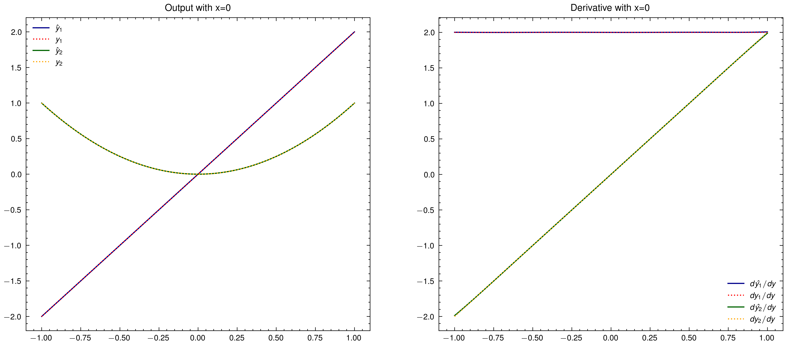

# PyTorch Derivative Test

This project aims to verify whether derivatives are well-trained when training a neural network using PyTorch. By comparing the learned derivatives with the true derivatives, we can assess the effectiveness of the training process.

## Installation

To use this project, you can easily set up the same environment using [`uv`](https://github.com/astral-sh/uv):

```bash
# Create virtual env
uv venv

# Sync
uv pip sync requirements.txt

# Activate
source .venv/bin/activate
```

This command will install all the required dependencies specified in the `requirements.txt` file.

Alternatively, you can use `pip` to install the dependencies:

```bash
pip install -r requirements.txt
```

## Usage

To run the project, simply execute the `equation_net.py` script:

```bash
python equation_net.py
```

The script will generate random data, train the neural network, and plot the learned functions and derivatives along with the true functions and derivatives.

## Results

The project generates two plots:

1. Output and derivatives with respect to x (y=0):


2. Output and derivatives with respect to y (x=0):



The solid lines represent the learned functions and derivatives, while the dotted lines represent the true functions and derivatives. By comparing the solid and dotted lines, you can assess how well the neural network has learned the functions and their derivatives.

## License

This project is licensed under the MIT License. See the [LICENSE](LICENSE) file for more information.
